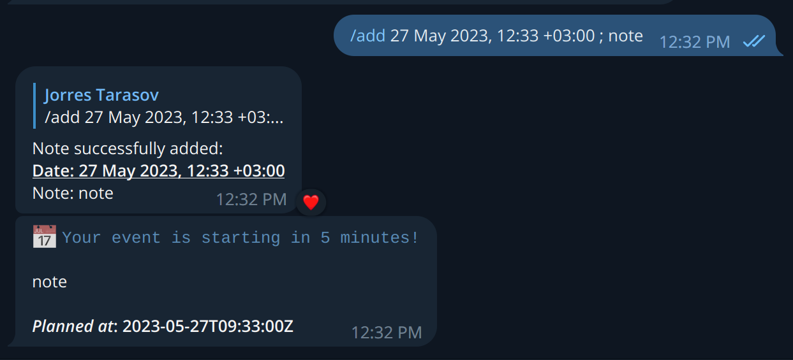

## Calendar bot

This is a fairly simple project.

#### Prerequisites

- Ensure you have `go` installed, tested on 1.19
- `go mod tidy` will install dependencies

#### Running tests

```bash
go test -v ./...
```

#### Running the bot locally

- Make sure you have the token for the bot. If you are the right person, you have it
  :) Once you have it, please put it into the `token.txt` file into the same
  directory as `main.go` file.

- Run the bot, using the command below. This will launch the bot and continiously
  print all the logging info to console:

```bash
go run main.go
```

#### Interacting with the bot

Text the @calendarNoteBot (https://t.me/calendarNoteBot) and call `/help`.

Main features include:

- `/notes` command allows you to add a note with a notification. Bot will guide
  you through the process.
- `/permissions` command allows you to allow other users to view your notes.
- `/show` command allows you to view all your notes (and notes of other people who
  have granted permissions to you)
- 5 minutes before the actual event, the bot will send you the message with a notification!
- 

Enjoy!

#### Observability

###### Monitoring

On the machine where the bot is hosted, ElasticSearch + Kibana stack has been deployed.
Obviously, it is a debug and testing setup, not a production ready one. We simply
don't have money to run production-ready ElasticSearch, sorry :(

However, you can search the logs of our application using a public ipv4-address
of the machine. Kibana is available at http://158.160.42.148:5601/app/discover, login-less access
is provided for the simplicity of testing and checking.
